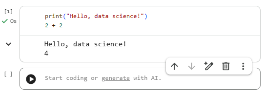
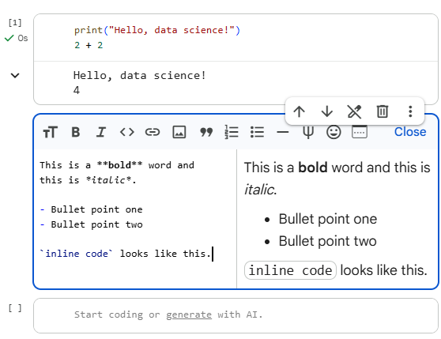
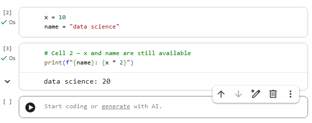

# Intro to Google Colab and Jupyter Notebooks

## Overview

In the previous lesson, you learned what data science is, what the field looks like in practice, and what this curriculum covers. Now it's time to set up the environment where all of your hands-on work will happen. In this lesson, you'll learn how to use **Google Colab** — a free, browser-based coding environment built on top of Jupyter Notebooks. You'll learn how to create and run notebooks, work with code and text cells, install libraries, and save your work. These are the mechanical skills that underpin every coding lesson in this curriculum.

## Learning Objectives

By the end of this lesson, you will have learned how to:

- Set up and navigate Google Colab/Jupyter Notebooks.
- Execute code cells, manage notebook files, and install necessary libraries.

## Key Terms

**Jupyter Notebook:** An interactive document format that combines live code, text, equations, and visualizations in a single file (`.ipynb`). The standard format for data science work.

**Google Colab (Colaboratory):** A free, cloud-hosted Jupyter Notebook environment provided by Google. Requires no local installation and includes free access to CPU and GPU compute.

**Cell:** The basic unit of a notebook. Each cell is either a **code cell** (runs Python) or a **markdown cell** (displays formatted text).

**Kernel:** The computational engine that executes the code in a notebook. In Colab, the kernel runs on a Google server. "Restarting the kernel" clears all variables and resets the runtime.

**Runtime:** Colab's term for the virtual machine and kernel assigned to your session. Runtimes disconnect after a period of inactivity.

**Markdown:** A lightweight markup language for formatting text using simple symbols (e.g., `**bold**`, `# Heading`, `- bullet`).

**Magic command:** A special Jupyter command prefixed with `!` or `%` that interacts with the shell or notebook environment rather than executing Python (e.g., `!pip install pandas`).

## Introduction

Every lesson in this curriculum has a companion notebook hosted in Google Colab. When you click a "Colaboratory notebook" link in any lesson, it opens a pre-configured notebook where you can run the lesson's code, modify it, and experiment freely.

Google Colab is free to use, requires no installation, and runs entirely in your browser. The only requirement is a Google account.

## Opening Google Colab

Navigate to [colab.research.google.com](https://colab.research.google.com). You'll see a welcome dialog with options to:
- Open a recent notebook
- Open from Google Drive
- Open from GitHub
- Create a new notebook

Select **New notebook** to create a blank notebook. A new tab will open with a single empty code cell.


## The Notebook Interface

A Colab notebook has three main areas:

```
┌─────────────────────────────────────────────────┐
│  File  Edit  View  Insert  Runtime  Tools  Help │  ← Menu bar
├──────┬──────────────────────────────────────────┤
│      │  + Code   + Text                         │  ← Add cell buttons
│ File │  ─────────────────────────────────────── │
│  Nav │  [ ] Code cell                           │  ← Active cell
│      │                                          │
│      │  [ ] Code cell                           │
│      │                                          │
│      │  ─── Markdown cell ───────────────────── │
└──────┴──────────────────────────────────────────┘
```

- **Menu bar**: File operations, runtime control, settings
- **+ Code / + Text**: Add a new code or markdown cell below the selected cell
- **Cells**: The content area where you write and run code or formatted text

## Code Cells

A code cell runs Python. Click inside a cell and type Python code:

```python
print("Hello, data science!")
2 + 2
```

Run a cell by:
- Pressing **Shift + Enter** (runs and moves to the next cell)
- Pressing **Ctrl + Enter** (runs and stays on the same cell)
- Clicking the **▶ play button** to the left of the cell

Output appears directly below the cell:



The last expression in a cell is displayed as output automatically — you don't need `print()` for simple values.

## Markdown Cells

A markdown cell displays formatted text — headings, bullet points, bold, code snippets, and mathematical formulas. Double-click any markdown cell to edit it.

```markdown
# This is a heading

This is a **bold** word and this is *italic*.

- Bullet point one
- Bullet point two

`inline code` looks like this.
```

Shift + Enter renders the markdown. Markdown cells are used for section titles, explanations, and documentation — a well-organized notebook alternates code and markdown to tell a story.



## Essential Keyboard Shortcuts

| Action | Shortcut |
|--------|----------|
| Run current cell | `Shift + Enter` |
| Run cell, stay on cell | `Ctrl + Enter` |
| Add code cell below | `Ctrl + M, B` |
| Add code cell above | `Ctrl + M, A` |
| Delete selected cell | `Ctrl + M, D` |
| Switch cell to Markdown | `Ctrl + M, M` |
| Switch cell to Code | `Ctrl + M, Y` |
| Comment/uncomment | `Ctrl + /` |
| Undo | `Ctrl + Z` |

## Variable Persistence

Variables defined in one cell are available in all subsequent cells — they persist in the kernel's memory for the entire session:



**Important:** Cells can be run in any order, and variables reflect the last time each cell was executed — not the order they appear on screen. Always run cells top-to-bottom when starting fresh to avoid confusion.

## Restarting the Runtime

If something goes wrong — variables are in an unexpected state, a library import failed, or memory is full — restart the kernel to get a clean slate:

- **Runtime → Restart runtime** (clears all variables, keeps notebook content)
- **Runtime → Restart and run all** (clears variables and reruns every cell from top to bottom)

After a restart, you must rerun all cells from the beginning.

## Installing Libraries

Colab comes with many data science libraries pre-installed (pandas, numpy, matplotlib, seaborn, scikit-learn). If you need a library that isn't included, install it with `!pip install`:

```python
!pip install plotly
```

The `!` prefix runs a shell command rather than Python. The installation applies only to the current runtime session — if the runtime restarts, you'll need to install again.

Check which version of a library is installed:

```python
import pandas as pd
print(pd.__version__)
```

## Mounting Google Drive

By default, Colab notebooks cannot access files on your Google Drive. To read or write files (like CSV datasets), mount your Drive:

```python
from google.colab import drive
drive.mount("/content/drive")
```

A pop-up will ask you to authorize access. After mounting, your Drive is accessible at `/content/drive/My Drive/`:

```python
import pandas as pd

# Read a CSV from Google Drive
df = pd.read_csv("/content/drive/My Drive/my_dataset.csv")
print(df.head())
```

## Uploading Files Directly

For quick uploads without mounting Drive, use the built-in file picker:

```python
from google.colab import files

uploaded = files.upload()   # Opens a file picker dialog
```

After uploading, the file is accessible by name in the current session:

```python
import pandas as pd
df = pd.read_csv("my_dataset.csv")
```

## Saving Your Notebook

Colab autosaves to Google Drive. You can also save manually:

- **File → Save** (`Ctrl + S`) — saves to Drive
- **File → Download → Download .ipynb** — saves a local copy of the notebook file
- **File → Save a copy in GitHub** — pushes the notebook directly to a GitHub repository (covered in the next lesson)

Notebooks are saved as `.ipynb` files — JSON documents that store your code, outputs, and markdown together.

## Checking Your Setup

Run the following cell to confirm that the core libraries are available and print their versions:

```python
import sys
import pandas as pd
import numpy as np
import matplotlib
import sklearn

print(f"Python:      {sys.version.split()[0]}")
print(f"pandas:      {pd.__version__}")
print(f"numpy:       {np.__version__}")
print(f"matplotlib:  {matplotlib.__version__}")
print(f"scikit-learn:{sklearn.__version__}")
```

If all five lines print without error, your environment is ready.

## Conclusion

Google Colab is the environment you'll use for every hands-on exercise in this curriculum. You now know how to create and run notebooks, work with code and markdown cells, install libraries, load files, and save your work. These are the mechanical foundations — get comfortable with them early, and they'll become second nature. In the next lesson, you'll learn how to use **GitHub** to save, version, and share your notebooks.

## Practice

### Knowledge Check

#### **Question 1: You define a variable `total = 500` in cell 3 of your notebook. You then delete cell 3 and run cell 5, which uses `total`. What happens?**
1. Python raises a `NameError` because `total` is no longer defined in the notebook.
2. `total` is still available because variables persist in the kernel's memory until the runtime is restarted — deleting a cell doesn't remove its previously executed variables.
3. The notebook automatically reruns cell 3 to restore the variable.
4. `total` defaults to 0 when the cell that defined it is deleted.

**Correct Answer:**
2. `total` is still available because variables persist in the kernel's memory until the runtime is restarted — deleting a cell doesn't remove its previously executed variables.

**Explanation:**
Colab (and Jupyter) maintains a running kernel that holds all variables in memory. Deleting a cell from the notebook removes it from the display, but it doesn't undo the code that was already executed. The variable `total` was loaded into memory when cell 3 was run and will remain there until the runtime is restarted. This is a common source of confusion — the notebook's visual appearance and the kernel's state can diverge. "Restart and run all" is the safest way to ensure they match.

---

#### **Question 2: You need to analyze a large CSV file stored in your Google Drive. After running `drive.mount("/content/drive")` and authorizing access, which path correctly reads the file?**
1. `pd.read_csv("my_data.csv")`
2. `pd.read_csv("/drive/my_data.csv")`
3. `pd.read_csv("/content/drive/My Drive/my_data.csv")`
4. `pd.read_csv("https://drive.google.com/my_data.csv")`

**Correct Answer:**
3. `pd.read_csv("/content/drive/My Drive/my_data.csv")`

**Explanation:**
When you mount Google Drive, it is attached to the Colab filesystem at `/content/drive`. Your personal Drive files are located at `/content/drive/My Drive/`. To read a file named `my_data.csv` stored at the root of your Drive, the correct path is `/content/drive/My Drive/my_data.csv`. Files in subfolders follow the same pattern: `/content/drive/My Drive/project/data/my_data.csv`.

---

#### **Question 3: What is the correct way to install a Python library that is not pre-installed in Colab?**
1. `import install plotly`
2. `pip install plotly` (typed directly in a code cell)
3. `!pip install plotly` (typed in a code cell, using the `!` prefix to run a shell command)
4. Libraries must be installed through the Colab settings menu — they cannot be installed via code.

**Correct Answer:**
3. `!pip install plotly` (typed in a code cell, using the `!` prefix to run a shell command)

**Explanation:**
In a Jupyter or Colab code cell, the `!` prefix runs a shell command rather than Python code. `pip` is a shell tool (Python's package manager), not a Python function, so it must be called with `!pip install`. Writing `pip install plotly` without the `!` will raise a `SyntaxError` because Python doesn't recognize `pip` as a valid keyword or function. After installation, the library is available for `import` in the same runtime session.
