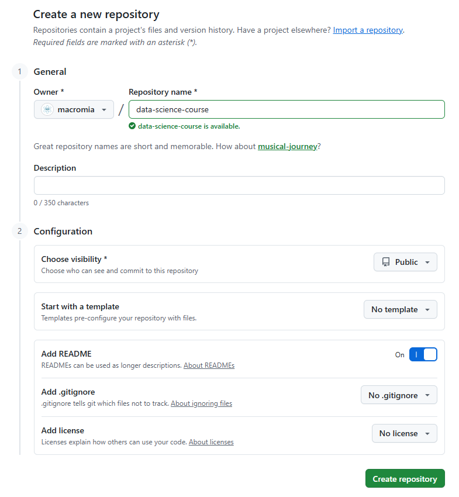
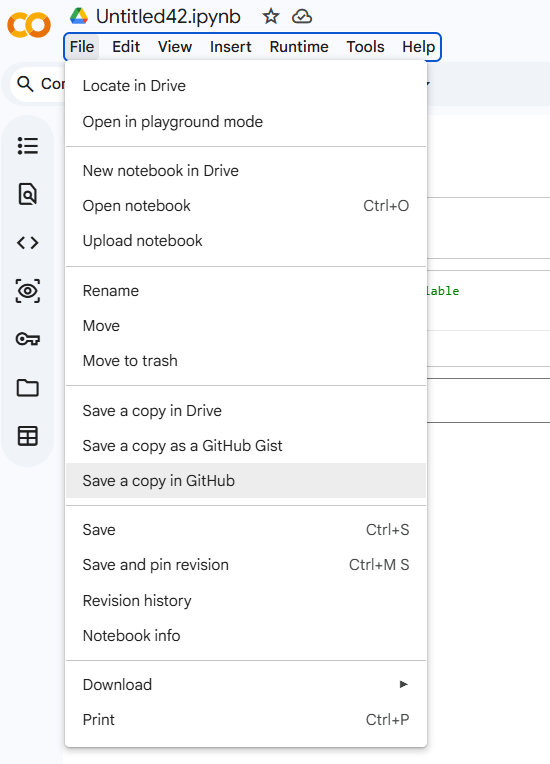

# Setting Up GitHub

## Overview

In the previous lesson, you set up Google Colab and learned how to create, run, and save notebooks. Now you need a place to store and share your work outside of Google Drive — somewhere that tracks changes over time, lets you collaborate with others, and serves as a portfolio of your projects. That place is **GitHub**. In this lesson, you'll create a GitHub account, understand the basics of Git version control, and learn how to save your Colab notebooks directly to a GitHub repository.

## Learning Objectives

By the end of this lesson, you will have learned how to:

- Initialize a GitHub repository and understand basic Git commands (clone, commit, push).
- Manage code versions and collaborate via pull requests. Save notebooks to GitHub.

## Key Terms

**Git:** A distributed version control system that tracks changes to files over time. Git is the underlying technology; GitHub is a website that hosts Git repositories.

**GitHub:** A cloud platform for hosting Git repositories, sharing code, and collaborating on projects. The industry standard for open-source and professional software development.

**Repository (repo):** A directory tracked by Git. Contains your files and the complete history of every change made to them.

**Commit:** A saved snapshot of your repository at a specific point in time. Every commit has a message describing what changed.

**Branch:** A parallel version of a repository. The default branch is called `main`. Branches let you develop new features without affecting the stable version.

**Clone:** Copying a remote repository (from GitHub) to your local machine or Colab session.

**Push:** Sending your local commits to the remote repository on GitHub.

**Pull:** Fetching and merging changes from the remote repository into your local copy.

**Pull request (PR):** A GitHub feature for proposing changes. You push changes to a branch, open a PR, and collaborators review before merging into `main`.

**README:** A markdown file (`README.md`) at the root of a repository that describes the project. GitHub displays it automatically on the repository's homepage.

## Introduction

Every notebook you build in this curriculum should be saved to GitHub. This gives you:

1. **Backup** — your work is never lost if your Colab session disconnects
2. **Version history** — you can see exactly what changed and when
3. **Portfolio** — recruiters and collaborators can see your projects
4. **Collaboration** — teammates can contribute and review your work

Git can feel intimidating at first — but for data science notebooks, you only need about five commands, which you'll learn in this lesson.

## Step 1: Create a GitHub Account

1. Go to [github.com](https://github.com)
2. Click **Sign up** and follow the prompts
3. Choose a professional username — this becomes part of your public profile URL (e.g., `github.com/yourusername`)
4. Verify your email address

## Step 2: Create Your First Repository

A repository holds one project — typically one directory of related files.

1. On GitHub, click the **+** icon (top right) → **New repository**
2. Name it something descriptive, e.g., `data-science-course`
3. Set it to **Public** (so it's viewable as a portfolio)
4. Check **Add a README file**
5. Click **Create repository**



Your new repository is now live at `https://github.com/yourusername/data-science-course`.

## Step 3: Save a Colab Notebook to GitHub

The easiest way to save a notebook from Colab to GitHub is through the built-in integration:

1. Open your notebook in Colab
2. Go to **File → Save a copy in GitHub**



3. Authorize GitHub access if prompted (first time only)
4. Select your repository and branch (use `main`)
5. Add a commit message describing what you're saving (e.g., `"Add Module 1 notebook"`)
6. Click **OK**

The notebook (`.ipynb` file) will appear in your repository. Refresh your GitHub repository page to see it.

## Understanding Git: The Core Workflow

Behind the scenes, every save to GitHub involves the same three-step pattern:

```
1. Make changes to files
        ↓
2. git add    — stage the changes you want to commit
        ↓
3. git commit — save a snapshot with a message
        ↓
4. git push   — send commits to GitHub
```

You can also perform these steps directly in Colab using the terminal (via the shell `!` prefix):

```python
# In a Colab code cell — configure Git with your identity (first time only)
!git config --global user.email "you@example.com"
!git config --global user.name "Your Name"
```

```python
# Clone your repository into the Colab session
!git clone https://github.com/yourname/data-science-curriculum.git
```

```python
# Move into the repository directory
import os
os.chdir("data-science-curriculum")
```

```python
# Copy your notebook into the repo folder, then stage, commit, and push
!git add my_notebook.ipynb
!git commit -m "Add Module 1 practice notebook"
!git push origin main
```

> **Note:** Pushing via HTTPS will prompt for a username and password. Use a **Personal Access Token** (PAT) instead of your password — generate one at `GitHub → Settings → Developer Settings → Personal Access Tokens`.

## Essential Git Commands

| Command | What it does |
|---------|-------------|
| `git clone <url>` | Copy a remote repository to your machine or session |
| `git status` | Show which files have changed or are staged |
| `git add <file>` | Stage a file for the next commit |
| `git add .` | Stage all changed files |
| `git commit -m "message"` | Save a snapshot with a descriptive message |
| `git push origin main` | Send commits to the `main` branch on GitHub |
| `git pull` | Fetch and merge remote changes into your local copy |
| `git log` | Show the commit history |

## Writing Good Commit Messages

A commit message should explain **what changed and why** — not just "update" or "fix stuff":

| Bad | Good |
|-----|------|
| `update` | `Add EDA notebook for Module 5` |
| `fix` | `Fix median imputation bug in age column` |
| `stuff` | `Complete feature engineering for house rental case study` |

A readable commit history is a professional habit. Treat it as a log that a teammate (or future you) can follow.

## Viewing Your Repository

Your repository at `github.com/yourname/data-science-curriculum` shows:

- **Files** — all files in the repository with their last commit message
- **README** — rendered automatically from `README.md`
- **Commits** — full history of every change
- **Code** — browse any file directly in the browser

GitHub renders `.ipynb` notebooks — viewers can see your code and outputs without running them. This makes your repository a living, readable portfolio.

## Branching and Pull Requests (Brief Overview)

For solo work, committing directly to `main` is fine. For collaborative projects, the standard workflow is:

1. Create a new branch: `git checkout -b feature/eda-analysis`
2. Make changes and commit on that branch
3. Push the branch: `git push origin feature/eda-analysis`
4. Open a **Pull Request** on GitHub — a request to merge your branch into `main`
5. A collaborator reviews the changes and approves or requests edits
6. Merge the PR — your changes join `main`

You'll use pull requests whenever you submit work for instructor review in this curriculum.

## Submitting Assignments

For each module assessment, you'll:

1. Complete the Colab notebook
2. Save it to your GitHub repository using **File → Save a copy in GitHub**
3. Copy the URL of the notebook file on GitHub (e.g., `https://github.com/yourusername/repo/blob/main/module1.ipynb`)
4. Submit the URL

The URL lets graders view your notebook, outputs, and commit history without needing to run any code.

## Conclusion

GitHub is where your data science work lives. Every notebook you complete in this curriculum should be committed there — both as a backup and as a growing portfolio. You now know how to create a repository, save notebooks from Colab, understand the add-commit-push workflow, and write meaningful commit messages. In the next lesson, you'll learn how to use **AI coding assistants** effectively as a pair programming partner — one of the most important productivity tools in modern data science.

## Practice

### Knowledge Check

<div class="quiz-container" data-correct="1" data-explanation="The 'Save a copy in GitHub' feature is a convenience wrapper around the standard Git workflow. Colab stages the `.ipynb` file, creates a commit with the message you provided, and pushes it to the specified branch of your repository. You can verify this by checking the commit history on GitHub — you'll see a new commit with your message and the notebook file added or updated.">
  <div class="quiz-question">
    <strong>Question 1:</strong> You've finished a notebook in Colab and want to save it to GitHub. You go to File → Save a copy in GitHub and complete the process. What actually happened behind the scenes?
  </div>
  <div class="quiz-options">
    <label class="quiz-option">
      <input type="radio" name="quiz-1" value="0">
      <label>Colab uploaded the notebook to GitHub using FTP (File Transfer Protocol).</label>
    </label>
    <label class="quiz-option">
      <input type="radio" name="quiz-1" value="1">
      <label>Colab executed a `git add`, `git commit`, and `git push` on your behalf — creating a new commit in your repository with the notebook as its content.</label>
    </label>
    <label class="quiz-option">
      <input type="radio" name="quiz-1" value="2">
      <label>Colab saved the notebook as a private gist, not directly to your repository.</label>
    </label>
    <label class="quiz-option">
      <input type="radio" name="quiz-1" value="3">
      <label>GitHub downloaded the notebook from Google Drive and imported it automatically.</label>
    </label>
  </div>
  <button class="quiz-check-btn">Check Answer</button>
  <div class="quiz-feedback"></div>
</div>

<div class="quiz-container" data-correct="1" data-explanation="Git operates in two stages. `git commit` saves a snapshot to your **local** repository — at this point, the change exists only on your machine (or your Colab session). `git push` transmits those local commits to the **remote** repository on GitHub, making them visible to collaborators and backed up in the cloud. It's common to make many local commits and push them all at once. Forgetting to push is a frequent mistake — your work appears saved locally but isn't on GitHub.">
  <div class="quiz-question">
    <strong>Question 2:</strong> What is the difference between `git commit` and `git push`?
  </div>
  <div class="quiz-options">
    <label class="quiz-option">
      <input type="radio" name="quiz-2" value="0">
      <label>`git commit` saves changes to GitHub; `git push` saves changes locally.</label>
    </label>
    <label class="quiz-option">
      <input type="radio" name="quiz-2" value="1">
      <label>`git commit` creates a local snapshot of staged changes with a message; `git push` sends those local commits to the remote repository on GitHub so others can see them.</label>
    </label>
    <label class="quiz-option">
      <input type="radio" name="quiz-2" value="2">
      <label>`git commit` and `git push` do the same thing — either one saves your work to GitHub.</label>
    </label>
    <label class="quiz-option">
      <input type="radio" name="quiz-2" value="3">
      <label>`git push` must be run before `git commit`, or the commit won't be saved.</label>
    </label>
  </div>
  <button class="quiz-check-btn">Check Answer</button>
  <div class="quiz-feedback"></div>
</div>

<div class="quiz-container" data-correct="2" data-explanation="A GitHub URL gives instructors access to the complete notebook — code, outputs, and markdown — rendered directly in the browser without needing to run it. It also shows the commit history, which provides evidence of when the work was done and how it evolved. Google Drive links require Drive permissions to be set correctly and don't display notebooks as well as GitHub. Email attachments don't include commit history and create version management problems.">
  <div class="quiz-question">
    <strong>Question 3:</strong> Your instructor asks you to submit your Module 2 notebook. Which submission is most appropriate?
  </div>
  <div class="quiz-options">
    <label class="quiz-option">
      <input type="radio" name="quiz-3" value="0">
      <label>Attach the `.ipynb` file as an email attachment.</label>
    </label>
    <label class="quiz-option">
      <input type="radio" name="quiz-3" value="1">
      <label>Share a screenshot of the notebook outputs.</label>
    </label>
    <label class="quiz-option">
      <input type="radio" name="quiz-3" value="2">
      <label>Submit the GitHub URL pointing to the notebook file in your repository (e.g., `github.com/yourname/curriculum/blob/main/module2.ipynb`).</label>
    </label>
    <label class="quiz-option">
      <input type="radio" name="quiz-3" value="3">
      <label>Share your Google Drive link so the instructor can open it in Colab.</label>
    </label>
  </div>
  <button class="quiz-check-btn">Check Answer</button>
  <div class="quiz-feedback"></div>
</div>
