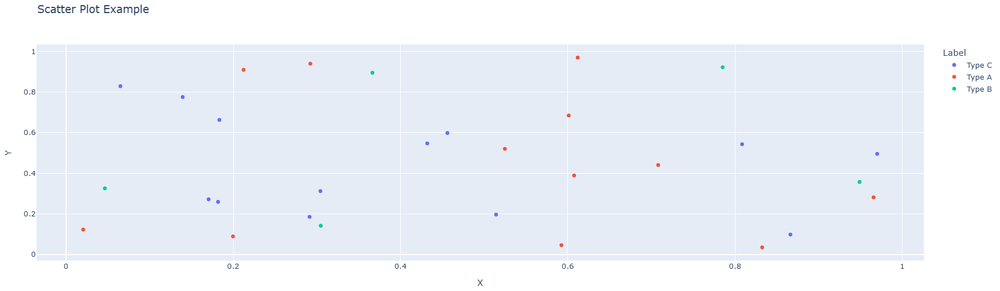
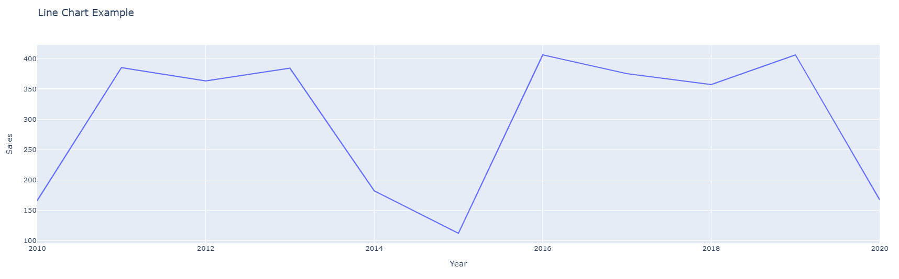
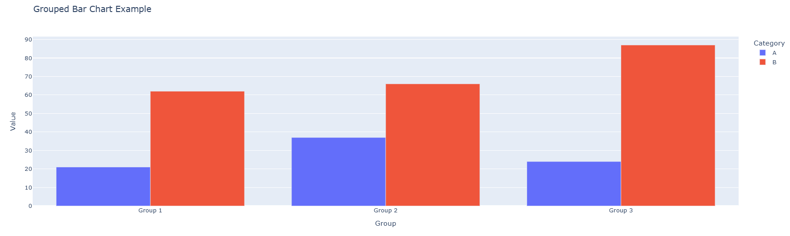

# Visualizing Data with Matplotlib

## Overview

In the previous lesson, you learned about the principles of data visualization and which chart types are best suited to different questions and data types. Now it's time to put those principles into practice. In this lesson, you'll learn how to create a variety of charts and plots using **Matplotlib**, the foundational Python library for building precise, publication-quality static visualizations.

## Learning Objective

By the end of this lesson, you will have learned how to:

- Create common chart types (scatter plots, line charts, bar charts, and histograms) with Matplotlib.
- Customize plots with titles, labels, legends, and colors.
- Understand the fundamental concepts of figure and axes in matplotlib.

## Key terms

**Matplotlib:** A comprehensive Python library for creating static, animated, and interactive visualizations with publication-quality graphics.

**Figure:** The overall window or canvas that contains one or more plots.

**Axes:** The area where the data is plotted, including the x-axis, y-axis, and any plotted elements.

## Starter Code

This lesson encourages experimentation. Use the included [*Colaboratory notebook*](https://colab.research.google.com/github/gabrielsanchez/curriculum-ds/blob/main/notebooks/04-data-visualization/02_matplotlib_starter.ipynb) to run the code as you learn, or read the lesson and then freely experiment with the notebook's code.

## Introduction

[*Matplotlib*](https://matplotlib.org/) is a versatile plotting library that provides a framework for creating visualizations at multiple levels of abstraction. Whether you're creating a quick exploratory plot or a polished publication-quality figure, matplotlib can handle it. Unlike interactive libraries like Plotly, matplotlib creates static images, which are ideal for reports, papers, and presentations. Matplotlib gives you fine-grained control over every aspect of your visualization, making it the go-to choice for data scientists and researchers.

## Installing and Importing Matplotlib

Matplotlib comes pre-installed in **Google Colab**, so you can start using it right away without any additional setup. However, if you're using **Jupyter Notebook** or another local Python environment, you may need to install it using the following command:

```bash
pip install matplotlib
```

Once installed, you can import Matplotlib in your Python script or notebook like this:

```python
import matplotlib.pyplot as plt
import numpy as np
```

- **`matplotlib.pyplot`** is the most commonly used interface for creating plots and figures.
- **`numpy`** is often used alongside matplotlib to generate and manipulate data.

After installation and import, you're ready to start creating visualizations with Matplotlib!

## Creating Basic Charts

### Scatter Plot

A scatter plot displays the relationship between two numerical variables, where each data point is represented by a dot at its coordinates on the x and y axes. This allows you to quickly identify trends, clusters, or outliers in your data.

First, create a sample dataset:

```python
# Create a new dataset for demonstration
import pandas as pd

df_scatter = pd.DataFrame({
    'X': np.random.rand(30),
    'Y': np.random.rand(30),
    'Label': np.random.choice(['Type A', 'Type B', 'Type C'], 30)
})
```

Now, create the scatter plot from the sample dataset:

```python
plt.figure(figsize=(8, 6))
plt.scatter(df_scatter['X'], df_scatter['Y'])
plt.title("Scatter Plot Example")
plt.xlabel("X")
plt.ylabel("Y")
plt.show()
```

The code above creates a figure with 8x6 inches size, plots the X and Y values as points, adds a title and axis labels, and then displays the chart. The resulting graph looks like this:



To add different colors for different categories, you can use the `c` parameter:

```python
colors = {'Type A': 'red', 'Type B': 'blue', 'Type C': 'green'}
plt.figure(figsize=(8, 6))
for label in df_scatter['Label'].unique():
    mask = df_scatter['Label'] == label
    plt.scatter(df_scatter[mask]['X'], df_scatter[mask]['Y'], 
                label=label, color=colors[label])
plt.title("Scatter Plot Example")
plt.xlabel("X")
plt.ylabel("Y")
plt.legend()
plt.show()
```

### Line Chart

A line chart displays data points connected by straight lines, making it ideal for showing trends over time or ordered categories. Use matplotlib's `plot()` function to create line charts. Here's an example:

First, create a sample dataset:

```python
# Create a new dataset for demonstration
df_line = pd.DataFrame({
    'Year': range(2010, 2021),
    'Sales': np.random.randint(100, 500, size=11)
})
```

Now, create the line chart from the sample dataset:

```python
plt.figure(figsize=(10, 6))
plt.plot(df_line['Year'], df_line['Sales'], marker='o', linewidth=2)
plt.title("Line Chart Example")
plt.xlabel("Year")
plt.ylabel("Sales")
plt.grid(True, alpha=0.3)
plt.show()
```

The code above creates a figure, plots the Year on the x-axis and Sales on the y-axis with circular markers at each data point, adds a title and axis labels, and displays a grid for easier reading. The resulting graph looks like this:



### Bar Chart

A bar chart is used to compare values across different categories. In matplotlib, you can create a bar chart using the `bar()` function. Here's an example:

First, create a sample dataset:

```python
# Create a new dataset for demonstration
df_bar = pd.DataFrame({
    'Category': ['A', 'B', 'C', 'D'],
    'Value': [23, 45, 56, 78]
})
```

Now, create the bar chart from the sample dataset:

```python
plt.figure(figsize=(8, 6))
plt.bar(df_bar['Category'], df_bar['Value'], color='skyblue', edgecolor='navy')
plt.title("Bar Chart Example")
plt.xlabel("Category")
plt.ylabel("Value")
plt.show()
```

The code above creates a figure, plots the Category on the x-axis and Value on the y-axis with light blue bars and navy blue edges, adds a title and axis labels, and then displays the chart. The resulting graph looks like this:



### Grouped Bar Chart

A grouped bar chart is used to compare multiple categories across different groups. Each group is represented by a set of bars, and each bar within the group represents a different category. Here's an example:

First, create a sample dataset:

```python
# Create a new dataset for demonstration
df_grouped = pd.DataFrame({
    'Group': ['Group 1', 'Group 2', 'Group 3'],
    'Category A': [10, 24, 36],
    'Category B': [20, 14, 26],
    'Category C': [15, 28, 32]
})
```

Now, create the grouped bar chart:

```python
x = np.arange(len(df_grouped['Group']))
width = 0.25

plt.figure(figsize=(10, 6))
plt.bar(x - width, df_grouped['Category A'], width, label='Category A')
plt.bar(x, df_grouped['Category B'], width, label='Category B')
plt.bar(x + width, df_grouped['Category C'], width, label='Category C')

plt.title("Grouped Bar Chart Example")
plt.xlabel("Group")
plt.ylabel("Value")
plt.xticks(x, df_grouped['Group'])
plt.legend()
plt.show()
```

The code above creates a figure and plots three sets of bars side by side for each group. The `np.arange()` function is used to position the bars, and the `width` variable determines the space between bars. The resulting graph looks like this:


### Histogram

A histogram displays the distribution of a numerical variable by dividing the data into bins and showing the frequency of values in each bin. Here's an example:

```python
# Create a dataset with numerical values
data = np.random.normal(loc=100, scale=15, size=1000)

plt.figure(figsize=(8, 6))
plt.hist(data, bins=30, color='purple', edgecolor='black', alpha=0.7)
plt.title("Histogram Example")
plt.xlabel("Value")
plt.ylabel("Frequency")
plt.show()
```

The code above creates a histogram with 30 bins, purple color with semi-transparency (alpha=0.7), and black edges. The resulting graph shows the distribution of the data.

## Customizing Plots

### Adding Titles, Labels, and Legends

Matplotlib provides various functions to customize your plots. You can add titles, axis labels, and legends using simple functions:

```python
plt.figure(figsize=(10, 6))
plt.plot(df_line['Year'], df_line['Sales'], marker='o', label='Sales')
plt.title("Customized Chart Title", fontsize=16, fontweight='bold')
plt.xlabel("X Axis Label", fontsize=12)
plt.ylabel("Y Axis Label", fontsize=12)
plt.legend(title="Legend Title", fontsize=10)
plt.grid(True, alpha=0.3)
plt.show()
```

This code customizes the chart with larger title text, bold formatting, and a legend. The `fontsize` parameter controls the text size, and the `grid()` function adds a background grid.

### Changing Colors and Styles

Matplotlib allows you to change colors, line styles, and marker styles:

```python
plt.figure(figsize=(10, 6))
plt.plot(df_line['Year'], df_line['Sales'], 
         color='#FF5733', linewidth=3, linestyle='--', marker='s', markersize=8)
plt.title("Customized Line Chart")
plt.xlabel("Year")
plt.ylabel("Sales")
plt.show()
```

In this example:
- `color='#FF5733'` sets a custom color using hexadecimal notation
- `linewidth=3` makes the line thicker
- `linestyle='--'` creates a dashed line
- `marker='s'` uses square markers
- `markersize=8` sets the marker size

### Creating Multiple Subplots

Matplotlib allows you to create multiple plots in a single figure using subplots:

```python
fig, (ax1, ax2) = plt.subplots(1, 2, figsize=(14, 5))

# First subplot
ax1.scatter(df_scatter['X'], df_scatter['Y'], color='red', alpha=0.6)
ax1.set_title("Scatter Plot")
ax1.set_xlabel("X")
ax1.set_ylabel("Y")

# Second subplot
ax2.bar(df_bar['Category'], df_bar['Value'], color='skyblue')
ax2.set_title("Bar Chart")
ax2.set_xlabel("Category")
ax2.set_ylabel("Value")

plt.tight_layout()
plt.show()
```

The `subplots()` function creates a figure with 1 row and 2 columns, allowing you to display multiple visualizations side by side.

## Conclusion

In this lesson, you learned how to create static visualizations using Matplotlib. You explored how to create scatter plots, line charts, bar charts, histograms, and grouped bar charts, and how to customize them with titles, labels, legends, colors, and various styling options. Matplotlib offers extensive capabilities for data visualization, and mastering these basics will prepare you for more advanced visualization tasks. For more information, check out [Matplotlib's documentation](https://matplotlib.org/stable/contents.html).

## Practice

### Coding Assessment

Practice the concepts from this lesson using this [notebook](https://colab.research.google.com/github/gabrielsanchez/curriculum-ds/blob/main/notebooks/04-data-visualization/02_matplotlib_practice.ipynb). After completing the exercises, save your notebook to GitHub and submit the link for grading.

### Knowledge Check

#### **Question 1: What is the primary advantage of Matplotlib compared to interactive libraries like Plotly?**
1. It creates interactive visualizations with zoom and hover features.
2. It creates static, publication-quality images that work well in reports and papers.
3. It requires no programming knowledge to use.
4. It only works with real-time data streams.

**Correct Answer:**  
2. It creates static, publication-quality images that work well in reports and papers.

**Explanation:**  
Matplotlib excels at creating static visualizations with precise control over every element, making it ideal for reports, academic papers, and presentations where you need consistent, high-quality output.

---

#### **Question 2: What is the purpose of the `figsize` parameter in `plt.figure()`?**
1. It sets the font size of the title.
2. It determines the number of subplots to create.
3. It specifies the width and height of the figure in inches.
4. It controls the color scheme of the plot.

**Correct Answer:**  
3. It specifies the width and height of the figure in inches.

**Explanation:**  
The `figsize` parameter takes a tuple of (width, height) in inches, allowing you to control the size of the entire figure. For example, `figsize=(10, 6)` creates a figure that is 10 inches wide and 6 inches tall.

---

#### **Question 3: What does the `alpha` parameter control in Matplotlib?**
1. The line style (solid, dashed, dotted).
2. The transparency of the plot elements.
3. The alignment of text labels.
4. The range of the x-axis.

**Correct Answer:**  
2. The transparency of the plot elements.

**Explanation:**  
The `alpha` parameter controls the transparency (opacity) of plot elements. A value of 0 is completely transparent, 1 is completely opaque, and values in between create a semi-transparent effect, which is useful when overlaying multiple data series.
