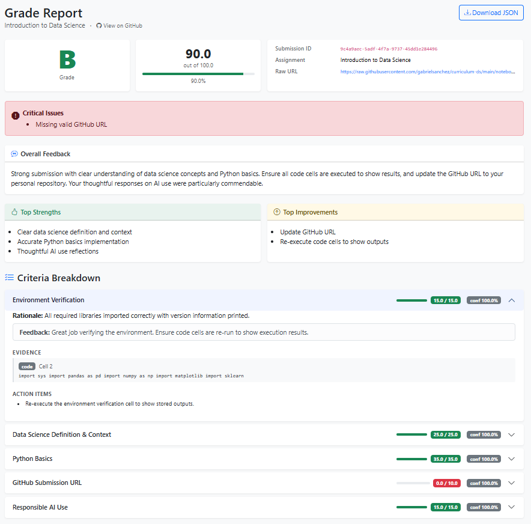
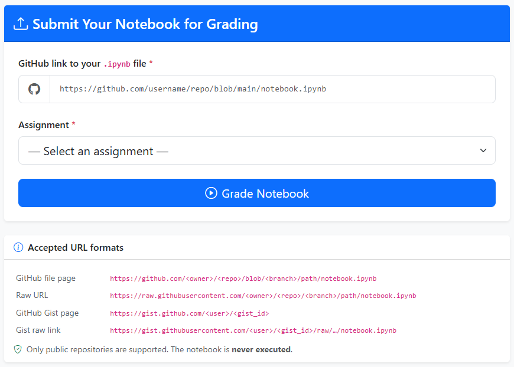

# Applied Data Science from Scratch

Welcome to **Applied Data Science from Scratch** — a hands-on, project-driven course that takes you from the fundamentals of Python all the way through deep learning and natural language processing.

This course is designed for learners who want to build real, working data science skills — not just read about them. Every concept is paired with runnable code, real datasets, and practical exercises.

This course is constantly being improved. If you have any suggestions or want to reach out for mentorship or a workshop please [feel free to reach out](http://macromia.ai).

---

## What This Course Covers

Data science sits at the intersection of programming, statistics, and domain knowledge. This course builds all three:

- **Programming foundations** — Python, data structures, and working with data libraries
- **Data skills** — cleaning, transforming, visualizing, and querying data
- **Machine learning** — from classic algorithms to deep learning and language models
- **Applied practice** — case studies and capstone projects that mirror real-world workflows

By the end of this course, you will be able to take a raw dataset, explore and clean it, engineer features, train and evaluate models, and communicate your results clearly.

---

## Course Structure

The course is organized into **17 modules**. Modules 1–7 build the foundations. Modules 8–17 apply those foundations to progressively more advanced machine learning topics, with case studies at key milestones.

| Module | Title | Topics |
|--------|-------|--------|
| 01 | Introduction to Data Science | The data science workflow, Google Colab, GitHub, AI pair programming |
| 02 | Introduction to Python for Data Science | Variables, functions, strings, lists, dictionaries, objects |
| 03 | Manipulating Data with Pandas | DataFrames, reading and writing data, selecting, mapping, grouping |
| 04 | Data Visualization | Matplotlib, Plotly, chart types and best practices |
| 05 | Exploratory Data Analysis | Summary statistics, histograms, box plots, correlation, outliers |
| 06 | Relational Databases | SQL, SQLite, querying, joins, SQL + Python integration |
| 07 | Introduction to Machine Learning | The ML workflow, supervised vs. unsupervised, feature engineering |
| 08 | Case Study: House Rental Dataset | End-to-end EDA, cleaning, and feature engineering on real data |
| 09 | Machine Learning: Classification | Binary, multi-class, and multi-label classification |
| 10 | Case Study: Mushroom Identification | Full classification pipeline from EDA to model selection |
| 11 | Machine Learning: Regression | Linear regression, polynomial regression, regularization, evaluation |
| 12 | Capstone I: Regression | Student-directed regression project on a dataset of your choice |
| 13 | Understanding ML Models | kNN, SVM, Random Forests, Gradient Boosting, Neural Networks |
| 14 | Deep Learning | Keras, convolutional networks, recurrent networks, optimization |
| 15 | Natural Language Processing | Text preprocessing, embeddings, transformers, NLP workflows |
| 16 | Case Study: Sentiment Analysis | Deep learning applied to sentiment classification |
| 17 | Final Capstone | End-to-end project combining skills from the entire course |

---

## Notebooks

This course includes **144 Jupyter notebooks** across all 17 modules. Each lesson comes with:

- A **starter notebook** — a partially complete notebook for you to work through
- A **practice notebook** — worked examples you can reference and run
- A **solution notebook** — a complete reference for module assessments

All notebooks are designed to run in [Google Colaboratory](https://colab.research.google.com/) with no local setup required.

---

## Module Assessments and the AI Grader

Each module ends with a **Module Assessment** — a coding challenge in a Jupyter notebook that tests the skills covered in that module.

You can submit your completed assessment notebooks to the **[AI Grader](https://ai-grader-production-07a3.up.railway.app/)** for instant feedback. The AI Grader reviews your code, checks your outputs, and provides specific, actionable feedback so you can improve before moving on.

To use the AI Grader:

1. Complete your module assessment notebook.
2. Visit [https://ai-grader-production-07a3.up.railway.app/](https://ai-grader-production-07a3.up.railway.app/).

3. Paste your notebook's Github URL. Select the module and submit.
4. Review the feedback and revise as needed.

---

## How to Use This Course

Work through the modules in order. Each module builds on the previous one, and the case studies assume you have completed the preceding content.

Within each module:

1. Read through the lesson pages in the book.
2. Open the corresponding starter notebook in Google Colab.
3. Complete the exercises in the lesson practice notebook.
4. Complete the module assessment and submit it to the AI Grader.

---

## License

This work is licensed under a Creative Commons Attribution-NonCommercial 4.0 International License (CC BY-NC 4.0).
